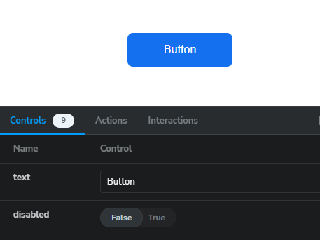
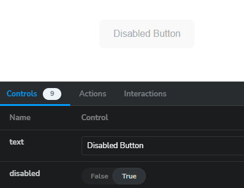

# Структура репозитория [universal-components-frontend](https://github.com/Zapchaztiulka/universal-components-frontend)

Компоненты содержатся в папке src/components. Для каждой компоненты создается отдельная папка, названная в соответствии ее содержимому. 

### Папка имеет следующую структуру:


`src/components/[ComponentFolder]/[ComponentName].tsx` — файл содержащий код компонента

`src/components/[ComponentFolder]/[ComponentName].stories.tsx` — файл содержащий стори,  которая позволяет продемонстрировать различные 
состояния компонента для проверки его внешнего вида и поведения

`src/components/[ComponentFolder]/index.ts` — файл для экспорта компоненты

В случае необходимости добавления кастомных стилей, следует добавить файл:
`src/components/[ComponentFolder]/[ComponentName].scss`

## Структура компонента `[ComponentName].tsx` и правила написания кода

- Название компонента пишется с большой буквы в PascalCase.
```
    ┃ ...
    ┣ 📂SomeComponent
    ┃ ┣ ...
    ┃ ┗ 📜SomeComponent.ts
    ┗ ...
```
- Разрешение файла следует использовать ts и tsx
- Стили компонента пишутся в kebab-case стиле

```
    // SomeComponent.ts
    ...
    const SomeComponent = ({ ... }) => {
      ...
      return (
          <div classNames="some-component">...</div>
      );
    }
    ...
```
- В каждом компоненте создается `interface` или `type` для props, название которых соответсвует названию кампанента с суфиксом `'Props'`
```
    // SomeComponent.ts
    ...
    interface SomeComponentProps {
        propA: string;
        propB: string;
        ...
    }
    
    const SomeComponent: FC<SomeComponentProps> = 
        ({ propA, propB, ... }: SomeComponentProps) => {
        ...
    }
    ...
```
- Экспорт компоненты из этого файла происходит через `export default`:
```
    // SomeComponent.ts
    ...
    const SomeComponent = ({ ... }) => {
      ...
    }
    ...
    export default SomeComponent; 
```
- Экспорт компонента из папки находится в файле `index.ts`. Это место, где компонент получает имя, через которое будет доступен.
```
    // index.ts
    export { default as TestExternalName } from './Test';
```

## Структура сторис `[ComponentName].stories.ts`
 Стори — это функция, которая описывает, как визуализировать рассматриваемый компонент.

- Импортируем компонет

```
import type { Meta, StoryObj } from '@storybook/react';
import Button from './Button';
```
- Задаем основные настройки страницы `storybook`
```
const meta = {
  title: 'Buttons/Component', // вложенность папок внутри страницы storybook
  component: Button,          // импортируемый компонент
  parameters: {
    layout: 'centered',
  },
  tags: ['autodocs'],
  argTypes: {
  },
} satisfies Meta<typeof Button>;

export default meta;
type Story = StoryObj<typeof meta>;
```
- Создаем стори, которому даем название, соответсвующее состоянию компонента (в данном случае - `Primary`)
- В `args` передаеем `props` компонента, которые можно динамически изменять на странице стори

```
export const Primary: Story = {
  args: {
    text: 'Button',
    disabled: false,
  },
};
```

- Описываем каждое состояние компонента в сторис
```
export const Disabled: Story = {
  args: {
    text: 'Disabled Button',
    disabled: true,
  },
};
```



